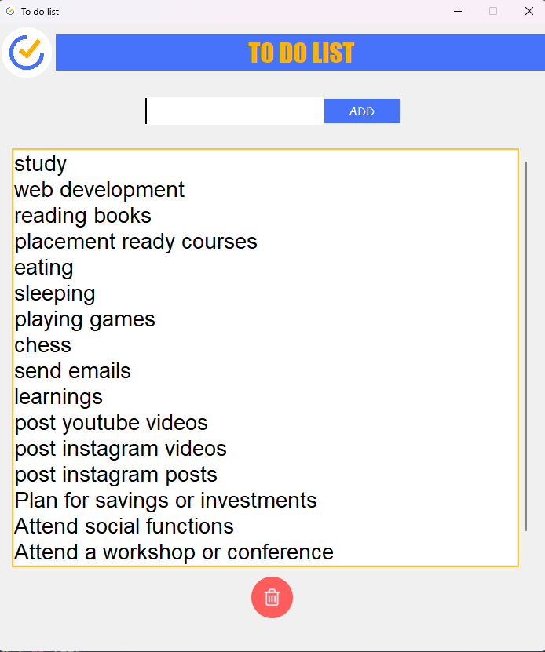

# Project Title

## To-Do List GUI in Python

A simple and user-friendly To-Do List application with a graphical user interface (GUI) built using Python and Tkinter.

## Table of Contents

- [Features](#features)
- [How It Works](#how-it-works)
- [Screenshots](#screenshots)
- [Getting Started](#getting-started)

## Features

- **Add Tasks:** Easily add new tasks to your to-do list.
- **Delete Tasks:** Remove completed tasks with a single click.
- **Persistent Storage:** Tasks are saved to a text file, ensuring your to-do list persists between sessions.

## How It Works

1. **Adding Tasks:**
   - Type your task in the input field.
   - Click the "ADD" button to add the task to the list.

2. **Deleting Tasks:**
   - Click the delete icon next to a task to remove it from the list.

3. **Persistence:**
   - Tasks are saved to a text file (`todos.txt`).
   - The application loads existing tasks from the file on startup.
   - Changes are saved automatically, ensuring your to-do list is preserved.

## Screenshots



## Getting Started

### Prerequisites

- Python 3.x

### Installation

1. Clone the repository:

```bash
git clone https://github.com/your-username/todo-list.git
